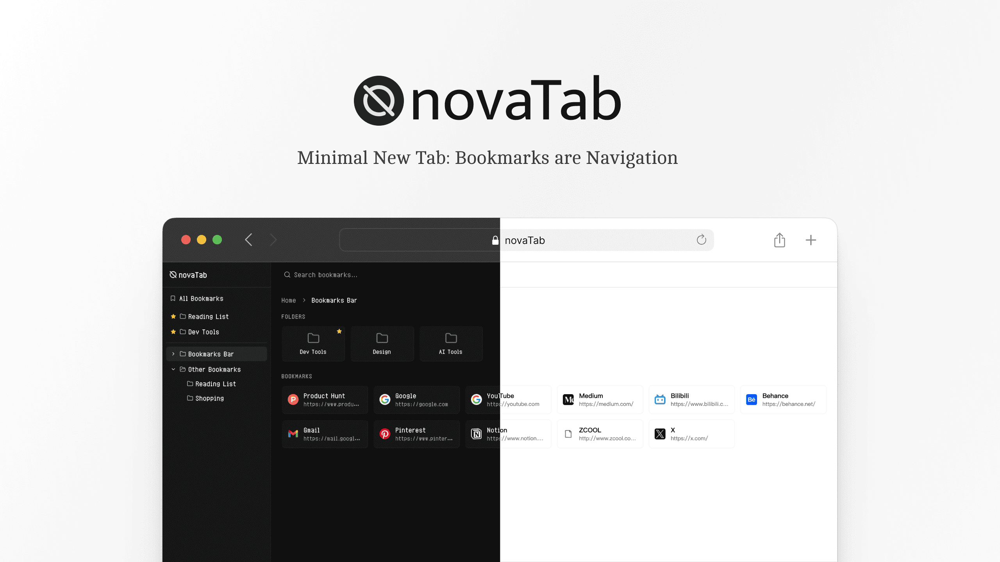

# novaTab

> 一款简洁的 Chrome 新标签页扩展，将浏览器书签以导航页的形式呈现，支持主题定制与全局搜索。

[](https://developer.chrome.com/docs/extensions/)
[](#)
[](https://react.dev)
[](https://typescriptlang.org)
[](https://tailwindcss.com)
[](./LICENSE)



[English](./README.md) | 中文

---

## 功能特性

- 🌲 **书签树侧边栏** — 完整展示书签层级结构，支持展开与折叠
- 🗂 **可视化网格** — 以卡片形式浏览文件夹和书签
- 🔍 **全局搜索** — 跨所有书签的实时搜索
- 🌗 **深色 / 浅色 / 跟随系统** — 自动适配操作系统主题偏好
- 🌐 **国际化** — 支持中文、英文、日文
- ⌨️ **键盘快捷键** — `/` 搜索 · `[`/`]` 折叠/展开 · `H` 回主页 · `?` 帮助
- 🔗 **书签可访问性检测** — 并发检测书签连通性，查看结果，并批量删除失效书签

## 技术栈

|        |                                     |
| ------ | ----------------------------------- |
| 框架   | React 18 + TypeScript (strict)      |
| 构建   | Vite 5 + `@crxjs/vite-plugin`       |
| 样式   | Tailwind CSS v4 + shadcn/ui (Radix) |
| 图标   | lucide-react                        |
| 国际化 | i18next + react-i18next             |

## 安装

1. 从 Release 页面下载 `nova.zip`，解压得到 `nova/` 文件夹
2. 打开 Chrome，访问 `chrome://extensions`
3. 开启右上角的**开发者模式**
4. 点击「加载已解压的扩展程序」，选择 `nova/` 文件夹

## 键盘快捷键

| 按键         | 操作                  |
| ------------ | --------------------- |
| `/`          | 聚焦搜索框            |
| `Esc`        | 清空搜索              |
| `[` / `]`    | 折叠 / 展开所有文件夹 |
| `H` / `Home` | 返回根目录            |
| `?`          | 打开快捷键说明        |

## 本地构建

**前置要求：** Node.js 18+、npm 9+、Google Chrome

```bash
npm install
npm run dev        # Vite 开发服务器 → http://localhost:5173
npm run build      # 生产构建 → dist/
npm run type-check # 提交前必须通过，退出码为 0
```

构建完成后，按照上方安装步骤加载 `dist/` 文件夹即可。

## 许可证

[MIT](./LICENSE)
